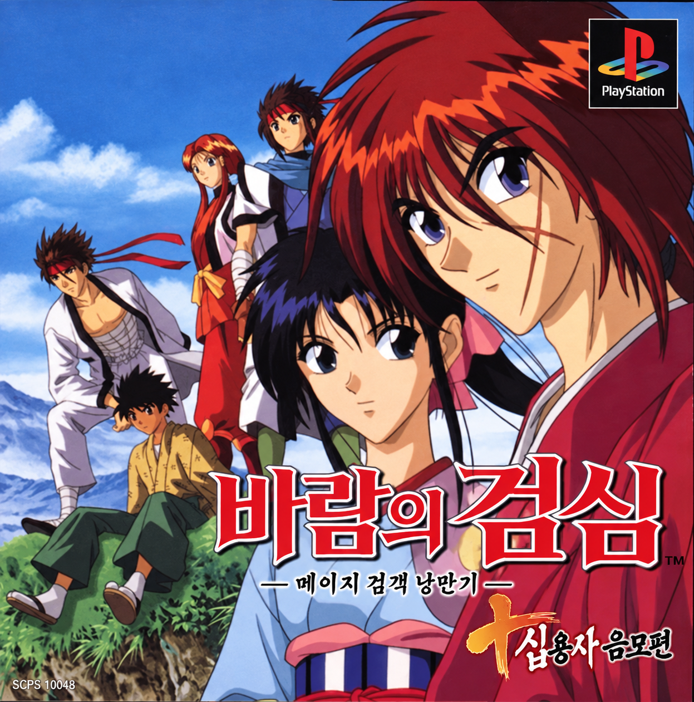

<p align="center"></p>

# 바람의 검심 -메이지 검객 낭만기- 십용사 음모편 한글화

플레이스테이션용 『るろうに剣心 -明治剣客浪漫譚- 十勇士陰謀編』(일본판, SCPS-10048)의 한글 패치 제작 프로젝트입니다.

> **현재 상태: 개발 중 (배포판 없음)**
> 한글 표시, 번역문 길이 증가, 제품 빌드 경로를 실제 게임에서 확인했습니다. 번역은 아직 시작하지 않았습니다.

## 진행 상황

| 항목 | 상태 |
|---|---|
| 디스크·컨테이너 구조 (ISO, GRP, Mode 2 섹터 EDC/ECC) | 완료. 무변경 재구성이 원본과 바이트 단위로 같음 |
| 대사 글꼴 경로 | 완료. 장면별 글꼴 블록을 번역문 기준으로 다시 만듦 |
| 한글 글꼴 | Galmuri14 (16×16 칸, 런타임 확인) |
| 띄어쓰기 | 반각 간격 토큰 `N;`(8px). ASCII 공백은 게임이 멈춰 사용 불가 |
| 대화창 용량 | 한 줄 18칸(288px), 화면 3줄, 긴 대사는 스크롤 |
| 번역문이 원문보다 길 때 | 문자열 풀 끝에 덧붙이고 참조를 고침 (10,401개 중 9,726개 가능, 런타임 확인) |
| 제품 빌드 (`tools/build.py`) | 완료. 번역 없이 빌드하면 원본과 SHA-256 동일 |
| 용어집 (만화 『바람의 검심』 표기 기준) | 인물·지명·아이템 초안, 일부 사용자 확정 |
| 대사 번역 (문자열 10,401개) | 초벌 14개 장면 2,321줄 (ZROUP00–12, 40) |
| 메뉴, 이름 입력, 전투 화면 | 조사 예정 |
| 타이틀 그림, 엔딩 크레딧, 영상 자막 | 조사 예정 |

자세한 조사 결과와 근거는 [`docs/survey.md`](docs/survey.md), 결정 사항은 [`docs/decisions.md`](docs/decisions.md), 번역 규칙은 [`docs/style.md`](docs/style.md), 작업 인계는 [`docs/HANDOFF.md`](docs/HANDOFF.md)에 있습니다.

## 지원 원본

정당하게 소유한 일본판 디스크 이미지(1트랙 `MODE2/2352` bin/cue)만 지원합니다. 원본 이미지와 게임 데이터는 이 저장소에 없으며 배포하지 않습니다.

| 항목 | 값 |
|---|---|
| bin 크기 | 534,856,560 바이트 |
| bin SHA-256 | `738f320c105dc7ab63515553112bd78a62041305ee4f3ebfeaf5b7df8bb2abd8` |
| bin MD5 | `a2a20dc4d977cf828b4136ef92fe1ba4` |

## 빌드

Python 3와 numpy가 필요합니다. 한글 글꼴은 [Galmuri](https://github.com/quiple/galmuri)의 `Galmuri14.bdf`를 씁니다.

```sh
python3 tools/build.py \
  --src "original/Rurouni Kenshin - Meiji Kenkaku Romantan - Juuyuushi Inbou-hen (Japan).bin" \
  --out build/kenshin_ko.bin \
  --galmuri ../galmuri/Galmuri14.bdf \
  --ko-dir text/ko --policy dev
```

- `--policy dev`: 초벌(draft)과 검수(reviewed) 번역을 모두 넣고 문제를 보고합니다.
- `--policy release`: 검수 완료 번역만 넣고, 문제가 하나라도 있으면 실패합니다.
- 결과로 `build/kenshin_ko.bin`과 `.cue`가 생깁니다. 원본과 다른 이미지에는 빌드를 거부합니다.

테스트는 `python3 -m pytest -q tests/`로 돌립니다. 원본 데이터가 필요한 테스트는 `original/`의 이미지와 `work/`의 추출본이 있을 때만 실행됩니다.

## 구조

| 경로 | 내용 |
|---|---|
| `tools/` | 디스크·컨테이너 도구(`iso.py`, `cdsector.py`, `grparc.py`), 대본·참조(`script.py`, `refs.py`), 한글 인코딩·글꼴(`koenc.py`, `kfont.py`, `scenefont.py`), 번역 파일(`textio.py`), 제품 빌드(`build.py`) |
| `tests/` | 위 도구의 테스트 |
| `docs/` | 조사 기록, 결정 기록, 스크립트 VM 명령 정의 |
| `text/ko/` | 한국어 번역 (예정). 일본어 원문은 저장소에 넣지 않고 빌드 때 원본에서 다시 뽑습니다 |

## 번역 방침

- 인물명, 지명, 기술명은 한국 정발 만화 『바람의 검심』 표기를 따릅니다.
- 초벌 번역과 검수는 Claude가 맡습니다. 사람 최종 검수 여부는 배포 시 패치 설명에 밝힙니다.

## 크레딧

- 한글 글꼴: [Galmuri](https://github.com/quiple/galmuri) by Lee Minseo, SIL Open Font License 1.1
- 원작: 和月伸宏 / 集英社, 게임: Sony Computer Entertainment. 이 프로젝트는 비공식 팬 번역이며 원저작권자와 관계가 없습니다.
